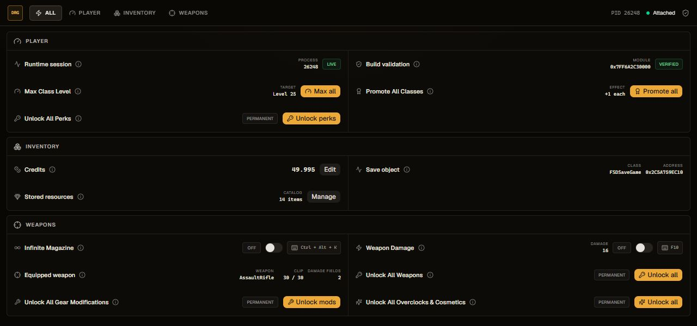
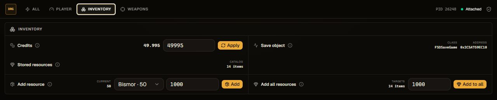
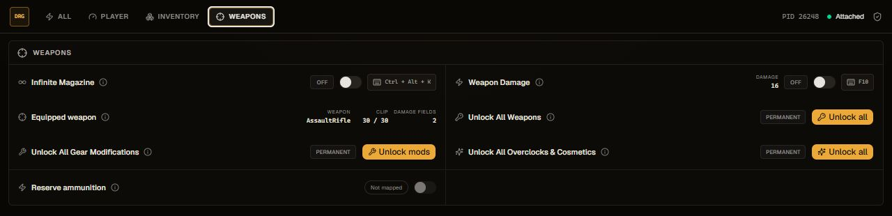

# DRG Runtime Trainer

Trainer desktop para **Deep Rock Galactic**, desenvolvido em Rust/Tauri com interface React. O aplicativo acompanha objetos do runtime do Unreal Engine e reúne ferramentas de inventário, progressão e armas em uma interface compacta.



_As capturas usam o modo de demonstração do frontend; valores e endereços exibidos são fictícios._

## Recursos

### Player

- Define Driller, Engineer, Gunner e Scout no nível 25.
- Promove as quatro classes uma vez usando a progressão nativa do jogo.
- Libera todos os perks.

### Inventory

- Lê e altera créditos com verificação após a escrita.
- Exibe os 14 recursos persistentes do inventário.
- Adiciona uma quantidade a um recurso específico ou a todos os recursos.



### Weapons

- Infinite Magazine acompanha a arma equipada e mantém o pente cheio.
- Weapon Damage acompanha os componentes de dano da arma ativa e mantém o valor em `9999`.
- Libera armas, modificações de equipamento, overclocks e cosméticos.
- Permite configurar hotkeys globais para recursos em tempo real.



## Compatibilidade e segurança

O trainer é específico para a versão conhecida do executável `FSD-Win64-Shipping.exe`. Antes de acessar offsets ou executar rotinas nativas, o backend valida o SHA-256 do jogo. Se a build mudar, as operações são bloqueadas até que o perfil seja atualizado.

Operações permanentes criam uma cópia dos saves em:

```text
FSD/Saved/SaveGames/DRGTrainerBackups/
```

O objeto ativo de save e a arma equipada são resolvidos dinamicamente e revalidados antes do acesso. Ainda assim, este projeto modifica memória e progresso salvo: mantenha backups e prefira uso solo ou em sessões privadas.

## Instalação

1. Baixe `DRG-Runtime-Trainer.exe` na página de Releases.
2. Abra o Deep Rock Galactic e entre na Space Rig.
3. Execute o trainer.

O executável é portátil e não possui instalador. Como não há assinatura de código, o Windows pode exibir o aviso do SmartScreen na primeira execução.

## Desenvolvimento

Pré-requisitos:

- Windows 10 ou 11 x64
- Node.js 20 ou mais recente
- Rust stable com target MSVC
- Microsoft Edge WebView2 Runtime

```powershell
npm install
npm run tauri dev
```

Build de release:

```powershell
npm run tauri build
```

O executável será gerado em `src-tauri/target/release/drg-credits.exe`.

## Estrutura

```text
src/
  components/trainer/       seções e componentes da interface
  hooks/                    comportamento compartilhado
  lib/                      bridge Tauri, mocks e formatação
  types/                    contratos do frontend
src-tauri/src/
  lib.rs                    comandos Tauri e hotkeys
  memory.rs                 perfil da build e orquestração do backend
  memory/
    process.rs              acesso Win32 ao processo
    unreal_runtime.rs       reflexão e objetos do Unreal Engine
    save_reader.rs          leitura e resolução do FSDSaveGame
    progression.rs          operações permanentes de progressão
    resources.rs            inventário persistente
    weapons.rs              recursos em tempo real das armas
```

## Aviso

Projeto independente, sem associação com Ghost Ship Games ou Coffee Stain Publishing. Deep Rock Galactic e seus elementos pertencem aos respectivos titulares.
